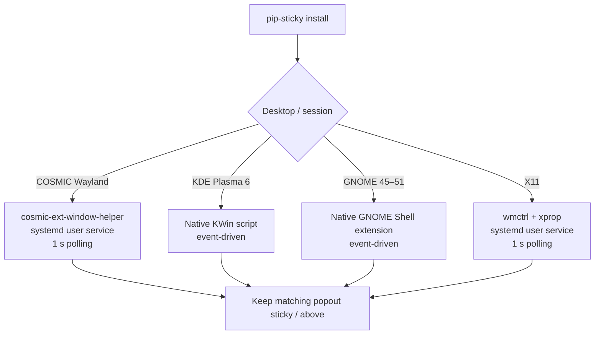

<div align="center">

# ◈ PiP Sticky

### Keep Picture-in-Picture and Discord-style popouts above your Linux desktop.

**COSMIC · KDE Plasma · GNOME · X11 · Firefox-family · Chromium-family**

<br>


<br><br>

**PiP Sticky automatically keeps supported Picture-in-Picture and Discord/Vesktop-style popout windows above other windows and available across workspaces.**

Version 2 expands the original Pop!_OS COSMIC + Firefox helper into a multi-desktop Linux utility with a backend chosen specifically for the desktop session you are running.

**No browser extension. No Discord modification. No always-running polling loop where the compositor already provides native events.**

<br>

[Install](#-install) ·
[Supported desktops](#supported-desktops) ·
[Commands](#commands) ·
[How it works](#how-it-works) ·
[Window matching](#window-matching) ·
[Troubleshooting](#troubleshooting)

</div>

---

# Quick start

## ⚡ Install

```bash
curl -fsSL https://raw.githubusercontent.com/MagnetosphereLabs/cosmic-firefox-pip-fix/main/pip-sticky.sh | bash -s -- install
```

The installer detects the current desktop/session and installs the appropriate backend automatically.

Depending on the desktop, PiP Sticky will use:

- `cosmic-ext-window-helper` on COSMIC Wayland
- a native KWin script on KDE Plasma 6
- a native GNOME Shell extension on GNOME 45–51
- `wmctrl` + `xprop` on X11

The installation is user-level. Root privileges are requested only when a missing system package must be installed, using `sudo` or `doas` when available.

After installation, the command is available at:

```text
~/.local/bin/pip-sticky
```

If `~/.local/bin` is already on your `PATH`, you can simply use:

```bash
pip-sticky status
```

> [!NOTE]
> On a brand-new GNOME installation, GNOME may require one log out / log in before it discovers the new local Shell extension.

---

## ⟳ Update

```bash
pip-sticky update
```

Or update directly from GitHub:

```bash
curl -fsSL https://raw.githubusercontent.com/MagnetosphereLabs/cosmic-firefox-pip-fix/main/pip-sticky.sh | bash -s -- update
```

The updater downloads the current script, verifies its Bash syntax, replaces the installed copy, and reinstalls the active desktop backend. If you are updating from the old v1 script, please uninstall it first using:

```bash
~/Apps/cosmic-firefox-pip-sticky/cosmic-firefox-pip-sticky.sh uninstall
```

Then run the install command for the current version:

```bash
curl -fsSL https://raw.githubusercontent.com/MagnetosphereLabs/cosmic-firefox-pip-fix/main/pip-sticky.sh | bash -s -- install
```

---

## ◇ Status

```bash
pip-sticky status
```

This shows the detected backend and the installation state relevant to that desktop.

For deeper diagnostics:

```bash
pip-sticky doctor
```

`doctor` prints desktop/session information, backend detection, package-manager information, and backend-specific diagnostics intended to make bug reports useful.

---

## ✕ Uninstall

```bash
pip-sticky uninstall
```

Or:

```bash
curl -fsSL https://raw.githubusercontent.com/MagnetosphereLabs/cosmic-firefox-pip-fix/main/pip-sticky.sh | bash -s -- uninstall
```

The uninstaller removes PiP Sticky's service and desktop integrations, including any KWin or GNOME backend that may have been installed during a previous desktop session.

Shared dependencies such as `cosmic-ext-window-helper`, `pipx`, `wmctrl`, and `xprop` are intentionally left installed because other software may use them.

---

# What is PiP Sticky?

Picture-in-Picture is most useful when the video or call remains visible while you work in another application.

On some Linux desktop environments, a PiP or detached call window can lose its always-on-top behavior, remain tied to one workspace, or behave differently depending on whether the application is native Wayland, Xwayland, or X11.

PiP Sticky applies the window policy at the desktop/compositor level.

Typical use cases include:

- Watching a YouTube or streaming PiP while working
- Keeping a Firefox-family PiP above other applications
- Keeping a Chromium-family PiP accessible
- Keeping a Discord or Vesktop-style detached call/popout visible
- Moving between virtual desktops without losing the managed popout

Where the backend exposes separate controls, PiP Sticky requests both:

```text
Always above other windows
        +
Visible on all workspaces/desktops
```

The original project handled this specifically for Firefox on Pop!_OS COSMIC. Version 2 keeps that behavior while adding desktop-specific integrations for a much wider Linux audience.

---

# Supported desktops

| Desktop / session | Backend | Behavior |
| --- | --- | --- |
| **COSMIC Wayland** | `cosmic-ext-window-helper` | Lightweight 1-second polling |
| **KDE Plasma 6 / KWin** | Native KWin JavaScript | Event-driven |
| **GNOME 45–51** | Native GNOME Shell / Mutter extension | Event-driven |
| **X11 desktops** | `wmctrl` + `xprop` | Lightweight 1-second polling |

The X11 backend is intended for standards-based X11 desktops such as Cinnamon, XFCE, MATE, Openbox, and similar window managers that honor the normal EWMH window-state controls.

> [!IMPORTANT]
> PiP Sticky does **not** treat the existence of `DISPLAY` as proof that a Wayland desktop is X11.
>
> Wayland sessions commonly expose `DISPLAY` through Xwayland. If the compositor does not have a native PiP Sticky backend, the installer refuses to pretend that managing only Xwayland windows is full Wayland support.

Other Wayland compositors therefore need their own compositor-specific backend.

---

# Supported popouts

PiP Sticky is designed around window behavior rather than a giant hard-coded browser package list.

It recognizes the common PiP forms used by:

- Firefox and Firefox-family browsers
- Chromium-family browsers
- Browser forks that expose compatible PiP titles or roles
- Discord / Vesktop-style detached popouts

Known PiP title forms include:

```text
Picture-in-Picture
Picture in picture
<name> - PiP
```

Discord-style popouts are recognized from:

```text
Discord Popout
Discord Popout ...
```

On backends that expose richer window metadata, PiP Sticky can also use PiP window roles/types and guarded Firefox-family utility-window detection.

---

# How it works

PiP Sticky first determines which desktop/session is actually running and then chooses a backend designed for that environment.



This is intentionally not one universal implementation.

Wayland compositors own window-management policy, so the reliable solution is to use the compositor's own APIs whenever possible.

---

## COSMIC Wayland

COSMIC preserves the approach used by the original project.

PiP Sticky uses:

```text
cosmic-ext-window-helper
```

and runs a user-level systemd service that checks for matching windows once per second.

The default query recognizes the normal Firefox/Chromium PiP titles, ` - PiP` titles, and Discord popouts while avoiding repeated work on windows already marked sticky.

If the helper is missing, the installer prefers an existing `uv` installation and otherwise installs `pipx`, then installs `cosmic-ext-window-helper` in an isolated Python environment.

---

## KDE Plasma 6 / KWin

KDE uses a native KWin script instead of a polling service.

The generated script listens for windows being added and for relevant window properties to change. When a target is positively identified, it applies:

```text
keepAbove = true
onAllDesktops = true
```

The KWin backend also remembers a managed popout after identification, so an Electron or browser window can change its title later without immediately escaping the rule.

During upgrades, the previous KWin script is disabled before replacement so stale signal handlers are not intentionally left active in the current session.

---

## GNOME 45–51

GNOME uses a local Shell extension backed by Mutter's native window API.

For managed windows it applies:

```text
make_above()
stick()
```

The extension watches newly created windows as well as windows that already exist when the extension is enabled.

It also tracks which state changes were introduced by PiP Sticky. When the extension is disabled, it attempts to undo only the `above` or `sticky` state that the extension itself added.

A brand-new local extension may require one log out / log in before GNOME discovers it. PiP Sticky also warns if GNOME's global **Disable User Extensions** switch is enabled.

---

## X11

X11 uses the standard tools:

```text
wmctrl
xprop
```

The service scans once per second and applies:

```text
above
sticky
```

to matching windows.

`xprop` provides structural hints such as `WM_WINDOW_ROLE` and `_NET_WM_WINDOW_TYPE`, which gives the X11 backend a fallback when a title alone is not enough.

Once an X11 window is positively identified, its XID is remembered until that window closes. Closed windows are removed from the runtime map so a future window that reuses the same XID does not inherit the old match.

---

# Window matching

Version 2 uses layered matching instead of depending on one application ID.

### 1. Stable titles

The first and simplest signal is the title used by common PiP/popout implementations:

```text
Picture-in-Picture
Picture in picture
... - PiP
Discord Popout
Discord Popout ...
```

Title matching is case-insensitive where the backend supports it.

### 2. PiP roles and window hints

KWin, GNOME, and X11 can inspect additional metadata.

PiP Sticky looks for role-like values equivalent to:

```text
pictureinpicture
pip
pipwindow
```

This helps with implementations where the visible title is not the canonical PiP title.

### 3. Guarded Firefox-family structural fallback

Firefox-family GTK PiP windows can appear as utility windows.

PiP Sticky does **not** make every utility window sticky. The structural fallback is restricted to known Firefox-family identities such as Firefox, Floorp, LibreWolf, Waterfox, Zen Browser, and IceCat.

That lets the tool catch more legitimate PiP windows without turning unrelated application dialogs into always-on-top windows.

### 4. Remember a positive match

KWin, GNOME, and X11 remember windows after they have been positively identified.

This matters for browser and Electron popouts whose title may change from a generic popout name to a call, site, or participant name after creation.

The COSMIC backend currently uses the title patterns supported by `cosmic-ext-window-helper`.

---

# Commands

| Command | Purpose |
| --- | --- |
| `pip-sticky install` | Detect the desktop and install/enable the correct backend |
| `pip-sticky update` | Download the latest script and reinstall the active backend |
| `pip-sticky uninstall` | Remove PiP Sticky and its desktop integrations |
| `pip-sticky status` | Show backend and installation health |
| `pip-sticky test` | Run a backend-specific test |
| `pip-sticky logs` | Show recent PiP Sticky logs |
| `pip-sticky doctor` | Print detailed diagnostics for troubleshooting/bug reports |
| `pip-sticky version` | Print the installed version |
| `pip-sticky help` | Show command help |

For COSMIC and X11, `run` is the internal service loop and normally does not need to be started manually.

---

# Testing and troubleshooting

Start with:

```bash
pip-sticky status
```

Then run:

```bash
pip-sticky test
```

If the problem is not obvious:

```bash
pip-sticky doctor
```

And inspect logs with:

```bash
pip-sticky logs
```

### Backend-specific notes

| Backend | Useful check |
| --- | --- |
| **COSMIC** | `doctor` shows the detected helper and performs the COSMIC matching test |
| **KWin** | `status` shows whether the `pipsticky` KWin package is installed/enabled |
| **GNOME** | `status` shows extension information and whether user extensions are globally disabled |
| **X11** | `doctor` shows `wmctrl` / `xprop` paths and matching windows |

KWin and GNOME log managed windows with:

```text
[pip-sticky]
```

COSMIC and X11 logs come from the user systemd service.

---

# Configuration

Most users should not need to configure anything.

The supported environment overrides are:

| Variable | Default | Purpose |
| --- | ---: | --- |
| `INTERVAL_SECONDS` | `1` | General polling default |
| `COSMIC_INTERVAL_SECONDS` | `1` | COSMIC polling interval |
| `X11_INTERVAL_SECONDS` | `1` | X11 polling interval |
| `FORCE_BACKEND` | empty | Force `cosmic`, `kwin`, `gnome`, or `x11` for testing |
| `HELPER_PATH` | `~/.local/bin/cosmic-ext-window-helper` | Override COSMIC helper location |
| `RAW_URL` | project raw URL | Override update/download source |

For example, to use a 2-second X11 interval:

```bash
X11_INTERVAL_SECONDS=2 pip-sticky install
```

Re-running `install` is intentional and safe: it refreshes the backend configuration for the current desktop.

For COSMIC or X11, the generated user service stores the selected interval in its environment.

---

# Version 1 migration

Version 2 replaces the original service named:

```text
cosmic-firefox-pip-sticky.service
```

During installation, PiP Sticky checks for the legacy unit, stops/disables it, removes the old service file, and reloads the user systemd configuration so both versions do not manage the same windows at once.

The old v1 script directory under:

```text
~/Apps/cosmic-firefox-pip-sticky/
```

may remain as an inert leftover from the original installation. Version 2 does not depend on it.

---

# Installed files

Common PiP Sticky files:

```text
~/.local/share/pip-sticky/pip-sticky.sh
~/.local/bin/pip-sticky
~/.config/pip-sticky/state
```

COSMIC and X11 additionally use:

```text
~/.config/systemd/user/pip-sticky.service
```

GNOME uses:

```text
~/.local/share/gnome-shell/extensions/pip-sticky@magnetospherelabs/
```

KWin installs the `pipsticky` KWin script package and uses a staging directory under:

```text
~/.local/share/pip-sticky/pipsticky/
```

The uninstaller removes PiP Sticky's own backend integrations but leaves shared third-party dependencies installed.

---

# Package-manager support

When PiP Sticky needs to install one of its helper packages, it understands:

```text
apt
dnf
pacman
zypper
```

Depending on the package manager, this covers the common Debian/Ubuntu, Fedora, Arch, and openSUSE-style package ecosystems.

The installer can use either:

```text
sudo
doas
```

for package installation.

PiP Sticky itself remains a per-user tool.

---

# Design goals

PiP Sticky v2 is deliberately built around a few rules:

- **Use native compositor APIs on Wayland whenever possible.**
- **Do not fake Wayland support by silently falling back to Xwayland.**
- **Match window behavior, titles, and roles before relying on package IDs.**
- **Use application identity only where it reduces false positives.**
- **Remember positively identified popouts when their titles later change.**
- **Keep polling limited to backends that actually need it.**
- **Run as the user and request privilege only for missing package installation.**
- **Leave shared dependencies installed on uninstall.**
- **Provide `status`, `test`, `logs`, and `doctor` so failures are diagnosable.**

---

<div align="center">

## ◈ Pop it out. Keep it there.

**COSMIC · KDE Plasma · GNOME · X11**

<br>

PiP Sticky does not modify your browser or Discord client.

### It makes the desktop treat the popout the way you expect.

</div>
